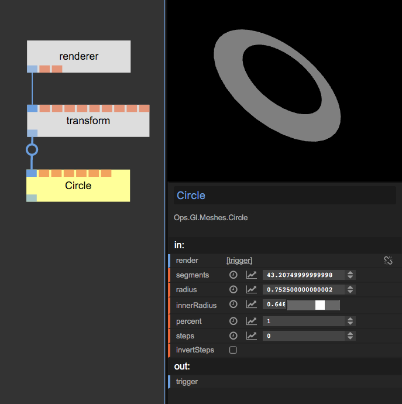

# Beginner 2: Transformations

This is part 2 of the beginner tutorial series. Before you proceed you should have completed [Part 1: Circle](../Beginner1_Circle/Beginner1_Circle.md).

To transform an object in 3D space we need a transformation operator.  
To insert an operator between two existing ops you can press the circle in the middle of the cable to link them. If the circle is not showing up, you have to select one of the ops first.

When you click the circle the `Select Op`-dialog shows up. Now enter `transform` and select `Ops.Gl.Matrix.Transform` and press enter.  
The new op should appear between the two existing once:  

Play around with the parameters of the transform op. You can now change the position, scaling and rotation of the circle:  

## Part 3

Continue to [Part 3](../Beginner3_Color/Beginner3_Color.md) of the tutorial-series to learn how to use colors.
