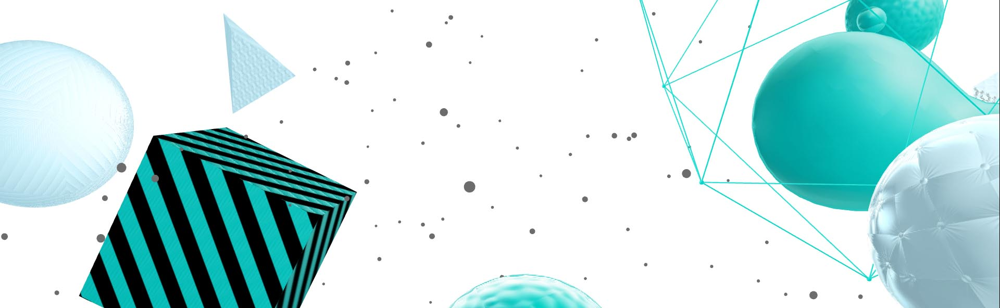

# cables Documentation

This is the official [cables](https://cables.gl) documentation.

*cables* is your model kit for creating beautiful interactive content. With an easy to navigate interface and results in real time, it allows for fast prototyping and prompt adjustments.

Working with cables is just as easy as creating cable spaghetti:

You are provided with a given set of operators such as mathematical functions, shapes and materials.
Connect these to each other using virtual cables to create the scene you have in mind.
Easily export your piece of work at any time. Embed it into your website or use it for any kind of creative installation.

Be sure to watch our [Video Tutorials on Youtube](https://www.youtube.com/watch?v=KPTGFM177HU&list=PLYimpE2xWgBveaPOiV_2_42kZEl_1ExB0).
