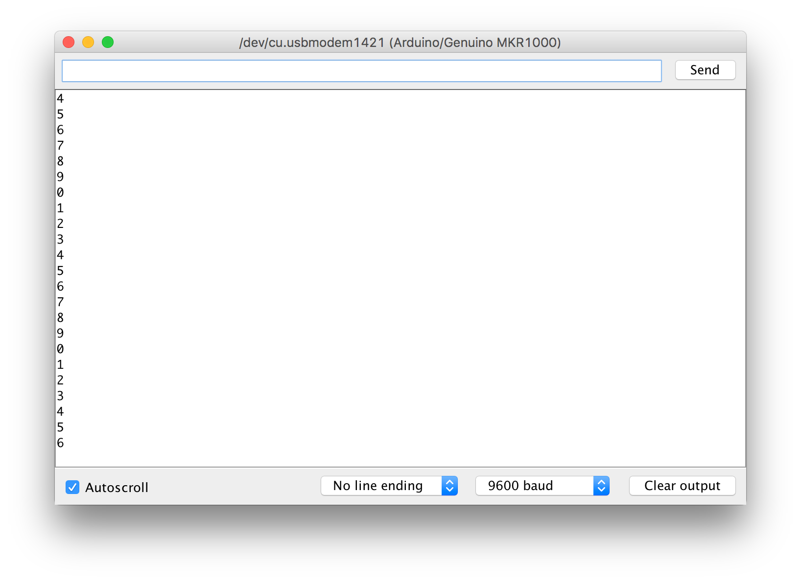
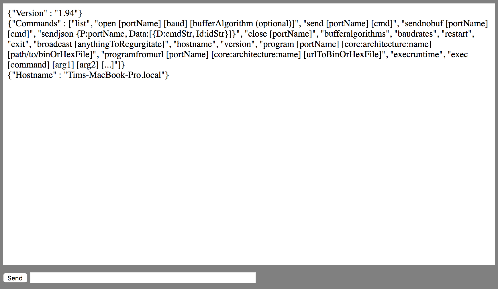
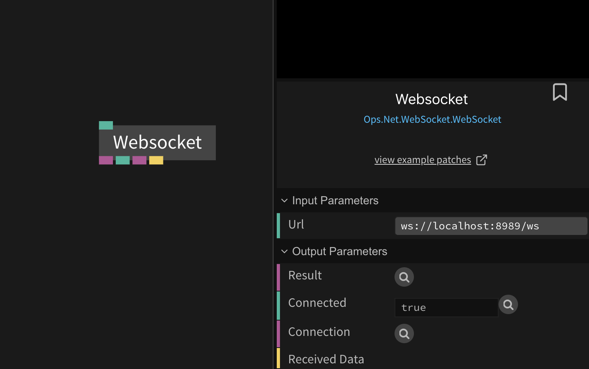
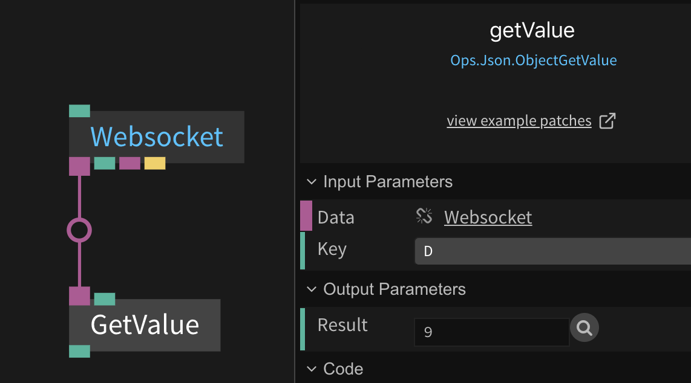

# Communication with an Arduino via Serial

The Serial protocol is currently not supported directly in the browser, but there is an easy workaround to use your Arduino, e.g. to control a cables patch using a sensor, in cables.  

First of all you need to connect an Arduino via USB and upload a basic patch which just outputs the numbers 0–9 via Serial:

```c
void setup() {
  Serial.begin(9600);
}

void loop() {
  for(int i=0; i<10; i++) {
    Serial.println(i);  
    delay(500);       
  }
}
```

If you open the Arduino Serial monitor (by pressing `cmd + shift + m`) you should see the following:



Now we need to download _serial-port-json-server_, a little helper tool to send the Serial data to your cables patch. Go to the [release page](https://github.com/chilipeppr/serial-port-json-server/releases), find the right version for your operating system and download it. If there is none for the latest release, just pick the release prior to that.

Once downloaded extract the zip-file, go into the extracted folder and you should see a file called `serial-port-json-server` / `serial-port-json-server.exe`.  Run this file in your Terminal / command prompt. On mac you do this by opening up Terminal-app, then `cd` into the directory, e.g.:

```bash
cd /Users/carolin/Downloads/serial-port-json-server-1.94_macosx
```

Then execute the binary by running:

```bash
./serial-port-json-server
```

You should now see an output like this:

```
2018/04/10 14:43:31 main.go:97: Version:1.94
2018/04/10 14:43:31 main.go:104: Hostname: Carolin-MacBook-Pro.local
2018/04/10 14:43:31 main.go:110: Garbage collection is on using Standard mode, meaning we just let Golang determine when to garbage collect.
2018/04/10 14:43:31 main.go:137: You can enter verbose mode to see all logging by starting with the -v command line switch.
2018/04/10 14:43:31 main.go:152: Your serial ports:
2018/04/10 14:43:31 main.go:159: 	{/dev/cu.Bluetooth-Incoming-Port cu.Bluetooth-Incoming-Port []      }
2018/04/10 14:43:31 main.go:159: 	{/dev/cu.usbmodem1421 cu.usbmodem1421 []      }
2018/04/10 14:43:31 main.go:159: 	{/dev/tty.Bluetooth-Incoming-Port tty.Bluetooth-Incoming-Port []      }
2018/04/10 14:43:31 main.go:159: 	{/dev/tty.usbmodem1421 tty.usbmodem1421 []      }
```

We now have a local websocket server running which we can use to create a bridge between the Arduino and cables!

Now open a new tab in your browser and go to `http://localhost:8989/`, this is the interface to the server we just started. The output looks a bit cryptic, but we won’t spend much time here…



Before we can access the Serial data, we need to connect to the Serial device. In the input field on the bottom enter `list` and press _Send_. This will list all available serial devices. The output should look something like this:

```
{ "SerialPorts": [ { "Name": "/dev/cu.Bluetooth-Incoming-Port", "Friendly": "cu.Bluetooth-Incoming-Port", "SerialNumber": "", "DeviceClass": "", "IsOpen": false, "IsPrimary": false, "RelatedNames": null, "Baud": 0, "BufferAlgorithm": "", "AvailableBufferAlgorithms": [ "default", "timed", "nodemcu", "tinyg", "tinyg_old", "tinyg_linemode", "tinyg_tidmode", "tinygg2", "grbl", "marlin" ], "Ver": 1.94, "UsbVid": "", "UsbPid": "", "FeedRateOverride": 0 }, { "Name": "/dev/cu.usbmodem1421", "Friendly": "cu.usbmodem1421", "SerialNumber": "", "DeviceClass": "", "IsOpen": false, "IsPrimary": false, "RelatedNames": null, "Baud": 0, "BufferAlgorithm": "", "AvailableBufferAlgorithms": [ "default", "timed", "nodemcu", "tinyg", "tinyg_old", "tinyg_linemode", "tinyg_tidmode", "tinygg2", "grbl", "marlin" ], "Ver": 1.94, "UsbVid": "", "UsbPid": "", "FeedRateOverride": 0 }, { "Name": "/dev/tty.Bluetooth-Incoming-Port", "Friendly": "tty.Bluetooth-Incoming-Port", "SerialNumber": "", "DeviceClass": "", "IsOpen": false, "IsPrimary": false, "RelatedNames": null, "Baud": 0, "BufferAlgorithm": "", "AvailableBufferAlgorithms": [ "default", "timed", "nodemcu", "tinyg", "tinyg_old", "tinyg_linemode", "tinyg_tidmode", "tinygg2", "grbl", "marlin" ], "Ver": 1.94, "UsbVid": "", "UsbPid": "", "FeedRateOverride": 0 }, { "Name": "/dev/tty.usbmodem1421", "Friendly": "tty.usbmodem1421", "SerialNumber": "", "DeviceClass": "", "IsOpen": false, "IsPrimary": false, "RelatedNames": null, "Baud": 0, "BufferAlgorithm": "", "AvailableBufferAlgorithms": [ "default", "timed", "nodemcu", "tinyg", "tinyg_old", "tinyg_linemode", "tinyg_tidmode", "tinygg2", "grbl", "marlin" ], "Ver": 1.94, "UsbVid": "", "UsbPid": "", "FeedRateOverride": 0 } ] }
```

Here we need to find the name of our Arduino (serial device), in my case this is `/dev/cu.usbmodem1421` . (this name also shows up in the Arduino app: `Tools` —> `Port`).

Now that we know the name of our Serial device enter the following command and press _Send_:

```
open /dev/cu.usbmodem1421 9600
```

This opens a Serial connection to your Arduino with the baud-rate `9600` (the same we used in our Arduino sketch). You should now see a (nearly) identical output to the Arduino Serial Monitor:


Great, let’s head over to cables, create a new patch and add the `WebSocket` op and enter  `ws://localhost:8989/ws` as `Url`.



Once entered the `Connected` port should change to `true`.  

If you now click on the little magnifier icon next to the `Result` port you can inspect the last message we received:  

Press `Update` and the `D`-property should change.

To make use of the incoming data we need to extract the value. Connect a `GetValue` op to the `Result` port and enter `D` as the key:  

From here on you can use the `Result` value however you like. In the [Arduino Serial Tutorial](https://cables.gl/p/5acb7afd7173b0651a826aac) patch you can see how the data from the Arduino changes the size of the circle.

Now go on and build some crazy things with Arduino + cables :)
