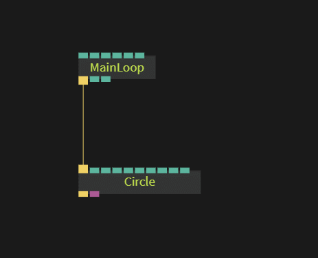

# Beginner 2: Transformations

This is part 2 of the beginner tutorial series. Before you proceed you should have completed [Part 1: Circle](../beginner1_circle/beginner1_circle.md).

To transform an object in 3D space we need the **transform** operator.  
To insert an operator between two existing ops you can click the **circle** in the middle of the cable. If the circle is not showing up, you have to select one of the ops first.

When you click the circle the `Select Op`-dialog shows up. Now type `transform` and select `Ops.Gl.Matrix.Transform` and press enter.  
The new op should appear between the two existing ops:  

Play around with the parameters of the transform op. You can now change the position, scaling and rotation of the circle:  

## Part 3

Continue to [Part 3](../beginner3_color/beginner3_color.md) of the tutorial-series to learn how to use colors.
