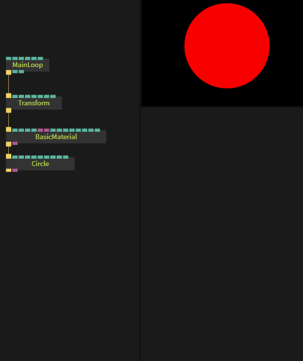

# Beginner 3: Color

[Back to Part 2](../beginner2_transformations/beginner2_transformations.md)

## Adding Color

To change the color and texture of 3d objects you can use materials.  

[Basicmaterial](https://cables.gl/op/Ops.Gl.Shader.BasicMaterial) is the most basic one.  

## Using Images As Texture

*Tip: To upload an image to cables, you can either upload it via the upload-button of an op which has a file-input or drag’n’drop an image onto the cables window*

- Create an `Ops.Gl.Texture`-op and connect it to your material (to the first purple texture port)
- The new texture op has a `file` input. Click the file icon next to it and select the uploaded image.

## Part 4

Continue to [Part 4](../beginner4_more_transformations/beginner4_more_transformations.md) to learn more on transformations
