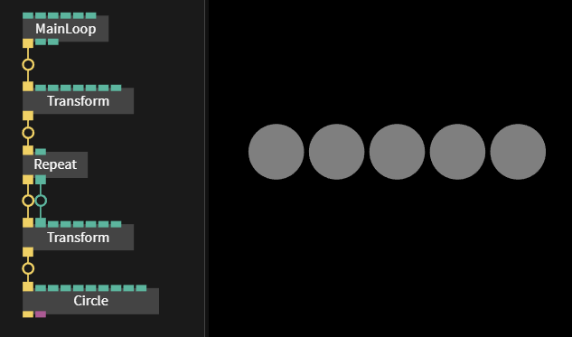
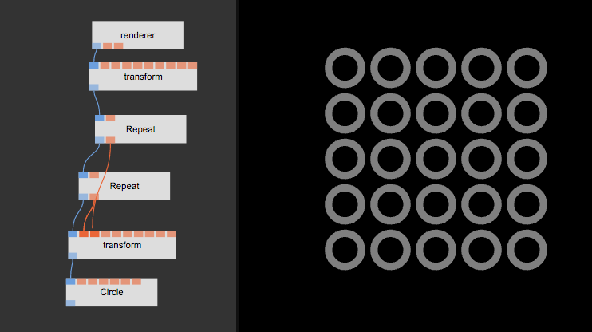
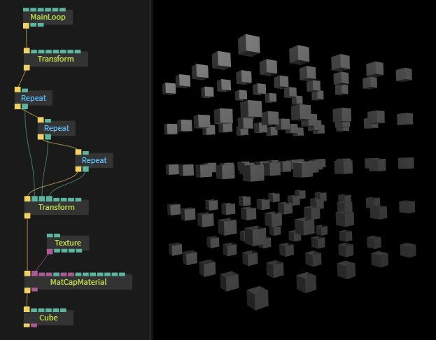

# More Transformations

[Back to part 3](../beginner3_color/beginner3_color.md)

To reuse the circle and draw multiple instances of them you can use the [Ops.Trigger.Repeat](https://cables.gl/op/Ops.Trigger.Repeat)

Add it like this:  

Now you still see one circle, but the `num`-parameter of `Repeat`-op has a value `5`. The 5 circles are currently drawn at the exact same position. To change this, we need to use the `Transform`-op again:  

- Connect the outgoing `index`-port of `Repeat` to the `x`-port of the 2nd transform object.
- Now there will be 5 circles, this is because the `Repeat` object outputs a number for each instance. In this case 1 to 5. Feeding this into the `Transform x` port moves each circle as far as it's index number.
- You may have to insert a new `Transform`-op __before__ the `Repeat`-op and adjust the position of them to see them all (use x/y/z transforms to center them)

It should now look like this:  

You can add another `Repeat`-op to make a 2D array of circles like this:  

With some more practice and adjustments it is possible to create a 3D cube of cubes. This example uses only two new ops: `matCapMaterial` and `cube`:

That’s it. You have finished the beginner tutorial series. Now you should have a look at the existing [examples](https://cables.gl/examples) and [public projects](https://cables.gl/projects) to learn more…
