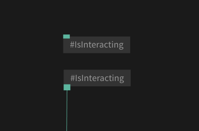
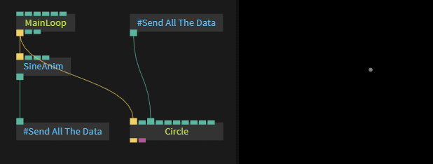

# Embedding Patches

## Variables

To work with variables in cables you can use the ops `SetVariable` / `SetVariableString` and `Variable`.
Variables are handy if you need the same values in many locations in your patch and don’t neet to see the connections or if you want to set a variable from outside cables.





- `SetVariable` – Set the value of the variable (for Number / Boolean)
- `SetVariableString` – Set the value of the variable (for String)
- `Variable` - Read the variable value (for Number / Boolean / String)

In a typical Situations you have one `SetVariable` / `SetVariableString` op and multiple `Variable` ops.

## Settings variables from outside cables

When you embed a patch into your website (see [Docs: Embedding](https://docs.cables.gl/dev_embed/dev_embed.html)) you can set cables-variables in your JavaScript-code:

short version:

```
    CABLES.patch.setVariable("IsInteracting",true);
```

long version (get the variable object)

```javascript
var myVar = CABLES.patch.getVar("IsInteracting");

if(myVar) {
    // get the current value
    var currentValue = myVar.getValue(); 

    // change the value
    myVar.setValue(true);    
}
```

*Please Note: Variable names are case sensitive, so a variable with name `My Variable` is different to one with name `my variable`.*

### Listening to variable changes

You can add a listener to a variable which gets called every time the variable changes:

```javascript
var myVar = CABLES.patch.getVar("IsInteracting");

if(myVar) {
	// will be called every time value changes
    myVar.addListener(function(newValue) {
        console.log(newValue);
    });
}
```


### Test setting / getting variables without leaving cables

If you want to test certain aspects of your patch which involve getting / setting variables from outside cables you can do so from the terminal:  

Open the browser terminal by hitting `cmd + alt + i`, then enter:

```javascript
var myCablesVar = gui.patch().scene.getVar('name of your variable');
myCablesVar.setValue(123);
console.log(myCablesVar.getValue()); // prints 123
```

*Summarising*: If you want to access a variable from outside cables use `CABLES.patch.getVar…`, if you want to test getting / setting variables without leaving cables, use `gui.patch().scene.getVar…`.  
