# Communicating with Arduino over MQTT

*Level: Beginner*  – you should already have read a tutorial on how to do basic things in cables, also soldering is needed for the electronic parts. 

In this tutorial we will show you how to establish a communication to an Arduino MKR1000 over the internet to control a rotating cube in cables with a physical cube (Arduino —> cables). We also add the possibility to change the color of the cube and see the physical cube adapt its color (cables —> Arduino).

### What is MQTT?

**MQTT** is a leightweight protocol which makes it easy to publish and subscribe information, much like [OSC](https://en.wikipedia.org/wiki/Open_Sound_Control), and use on various devices.  

In order to send / receive data you need to have access to a MQTT-server (broker). Luckily there are some free ones around, our favoruite is [shiftr.io](https://shiftr.io).  

When sending data you have to specify a topic to send data to, in our case we want to send the rotation of the physical cube as (x, y, z) to the topic `/orientation`. The color values will be sent to the topic `/color`. On the other end we can then listen to changes on the specific topic to get notified when new data is coming in. But we will come to that later …

## Needed Parts

- [Arduino / Genuino MKR1000](https://www.arduino.cc/en/Main/ArduinoMKR1000)
- [Adafruit 9-DOF Absolute Orientation IMU Fusion Breakout - BNO055](https://www.adafruit.com/product/2472)
- [NeoPixel Ring - 12 x 5050 RGB LED with Integrated Drivers](https://www.adafruit.com/products/1643)

## Setting up a user account on [shiftr.io](https://shiftr.io)

shiftr.io also offers a test-account (without the need to register) with *username: try*, password: `try`. In our tests a registered account was running much more stable, so go on and register a account and come back …

## Arduino Library Installation

Before we can get started, we have to install some libraries. Klick on *Sketch* —> *Import Library* —> *Manage Libraries* and install the libraries `Adafruit BNO055`, `Adafruit NeoPixel`, `WiFi101` and `MQTT` (the one by Joel Gaehwiler).

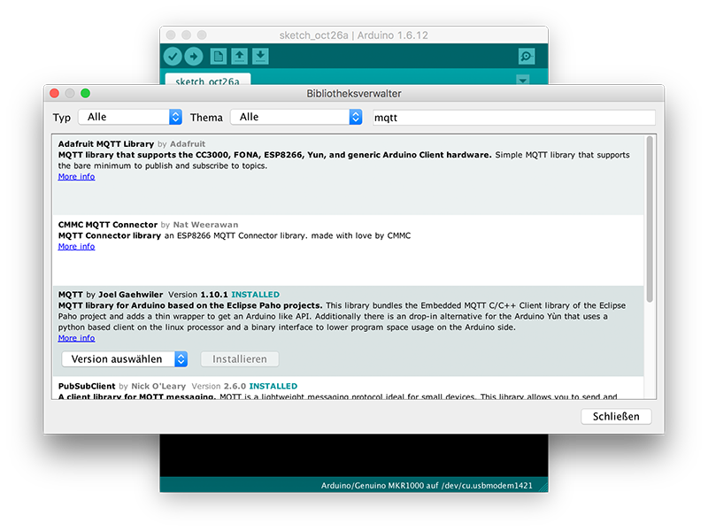

## Testing the components

In genereal it’s a good idea to test every functionality of our project on its own and make sure they work individually. 

Follow the tutorial on [Getting started with the Arduino/Genuino MKR1000](https://www.arduino.cc/en/Guide/MKR1000) and make sure you can successfully upload the *Blink* example (*Examples* —> *Basic* —> *Blink*). 

Then let’s start with testing the internet connection of you MKR1000 …

### Wifi

- Open the Arduino-example: *Examples* —> *WiFi101* —> *ConnectWithWPA* / *ConnectWithWEP* (depending on the encryption type of the router)


- Select the MKR1000 under *Tools* —> *Board* —> *Arduino/Genuino MKR1000*
- Select the port under */dev/cu.usbmodem1421* (or similar)
- Upload the code by pressing the upload button in the top bar or pressing `CMD + U`
- Open the serial monitor: *Tools* —> *Serial Monitor* (Or `SHIFT + CMD + M`)

If the MKR1000 can connect to the internet you should see something like this:

```
Attempting to connect to WPA SSID: YOURWLANNAME
You're connected to the networkSSID: YOURWLANNAME
…
```

Great, let’s move on and test the MQTT-connection …

### MQTT

Open the example *MQTT* —> *ArduinoWiFi101*

In line 16 and 17 change your wlan name (ssid) and password:  

```c
char *ssid = "ssid";
char *pass = "pass";
```

Now let’s change line 61:

```c
client.publish("/hello", "world");
```

to something unique:

```C
client.publish("/hellofromarduinoooo", "world");
```

Now upload the code, open the *Serial Monitor* and you should see:

```
connected!
```

Now go to [shiftr.io/try](https://shiftr.io/try) and you will see something like this:

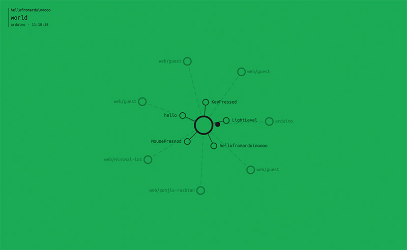

Here we see the device `arduino` sending data to the channel `hellofromarduinoooo` – so it worked.   

As we currently use the public namespace with the test login data let’s create an account on [shiftr.io](https://shiftr.io). Follow the instructions [here](https://shiftr.io/get-started) to create a namespace for yourself.  

To authenticate you need a token, which consists of a username and password. There are two types of tokens – read-tokens and read-write-tokens. Insert your read-write token into line 40:

```C
while (!client.connect("arduino", "try", "try")) {
```

The first parameter is the device name, this can be freely set (e.g. your name), the second parameter is the username and the third the password.  On shiftr.io this will be presented as `tokenname / tokenpassword`.  

```C
while (!client.connect("yourname", "read/write token name", "token password")) {
```

So now we have our own namespace.

## MQTT in cables

For the communication with MQTT in cables you need three ops – `Mqtt` (for authenthication), `MqttSend` to send information and `MqttReceive` to receive information. 

 Let’s create a new project on [cables.gl](https://cables.gl) and insert these three ops: 

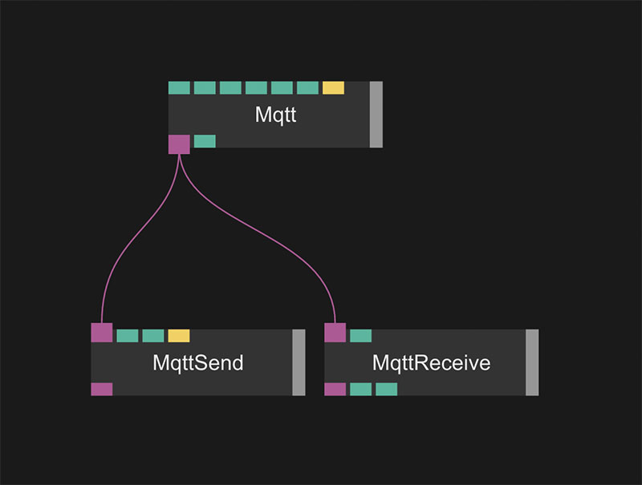

Connect the `Mqtt` out port `MQTT Object` to the `MQTT Object` in ports of `MqttReceive` and `MqttSend`.  

Per default the MQTT-ops use the public namespace (`try` / `try`). Select the MQTT op and put in your own read/write user token. Click `Reconnect` (a few lines below).

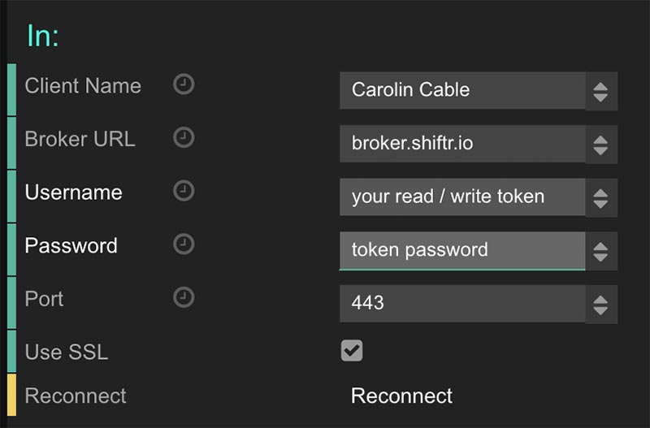

As the MQTT ops are still a bit experimental save the patch by pressing `CMD + s` inside the patch view and then reload the page by pressing `CMD + r`.  

Now if you click on the MQTT-Receive-op you should see that the output-port changed and that we received our data:  

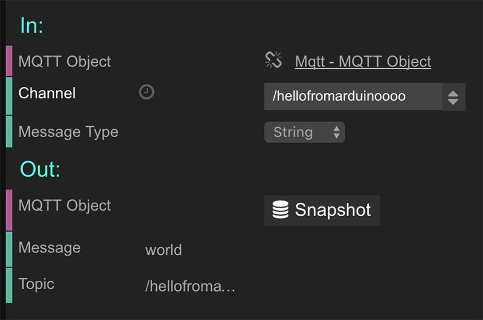

Great. So we successfully sent over some data over the internet from Arduino to the cables frontend.

Now let’s go back to Arduino and test the *BNO055* motion sensor …

### Getting started with BNO055 Motion Sensor

Connect your *Arduino / Genuino MKR1000* and *BNO055* to a breadboard and connect them like this:  

| Arduino MKR1000 | BNO055 |
| --------------- | ------ |
| VCC             | VIN    |
| GND             | GND    |
| SDA             | SDA    |
| SCL             | SCL    |


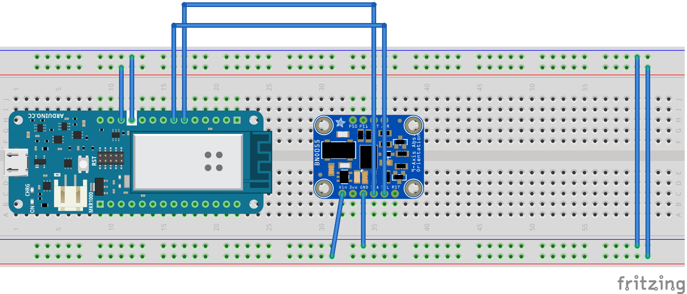

You can also connect `GND` and `VIN` directly to the *Arduino*, but using the outer lines of the breadboard for power and ground is a good practice and makes things easier if you work with multiple components.  

Run the sketch *Examples* —> *Adafruit BNO055* and open the serial monitor and rotate the breadoard, if you see something like this the sensor is working:  

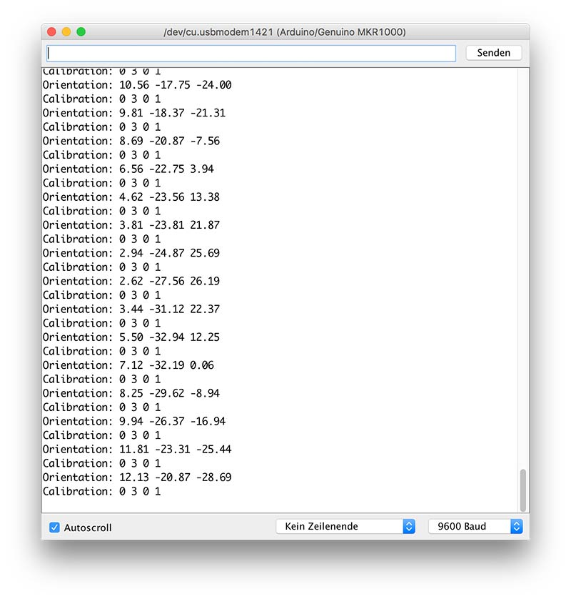

Now let’s put the MQTT-example together with the BNO055-example.

## Sending sensor data via MQTT

Create a new Arduino sketch and paste in this code, it’s a combination of the *MQTT*-example and the *BNO055*-example. We will discuss the changed pieces later …

```c
/*
 * This example uses an Arduino / Genuino Zero together with
 * a WiFi101 Shield or a MKR1000 to connect to shiftr.io.
 * 
 * Libraries which need to be installed:
 *     - "WiFi101" (install via Arduino libraries manager)
 *     - "MQTT" (by Joel Gaehwiler, install via Arduino libraries manager)
 *     
 * By undev / cables.gl    
 * https://github.com/cables-gl/Workshop_Hyper_Island_2016
 *     
 * Based on example by Gilberto Conti
 * https://github.com/256dpi/arduino-mqtt       
 * 
 * You can check if your device successfully sends messages here:
 * https://shiftr.io/try
 * Also open the serial monitor in Arduino to check for errors
 * 
 * Connections: (BNO055: Arduino MKR1000)
 *   - GND: GND
 *   - VIN: VCC
 *   - SDA: SDA
 *   - SCL: SCL
  */
  
  /* Board layout:
         +----------+
         |         *| RST   PITCH  ROLL  HEADING
     ADR |*        *| SCL
     INT |*        *| SDA     ^            /->
     PS1 |*        *| GND     |            |
     PS0 |*        *| 3VO     Y    Z-->    \-X
         |         *| VIN
         +----------+
  */
 

#include <SPI.h>
#include <WiFi101.h>
#include <Wire.h>
#include <MQTTClient.h>
#include <Adafruit_Sensor.h>
#include <Adafruit_BNO055.h>
#include <utility/imumaths.h>

#include "config.h" // WLAN / MQTT user credentials

// how often messages are send (in milliseconds)
#define SEND_DELAY_MS (100)

// MQTT details
char *mqtt_server = "broker.shiftr.io";
char *mqtt_username = "YOUR READ WRITE TOKEN NAME";
char *mqtt_password = "YOUR TOKEN PASSWORD";
char *device_name = "MKR1000"; // can be freely set, e.g. your name

// Wireless LAN details
char ssid[] = "YOUR WLAN NAME";     //  your network SSID (name)
char pass[] = "YOUR WLAN PASSWORD";  // your network password

Adafruit_BNO055 bno = Adafruit_BNO055(55);

int status = WL_IDLE_STATUS;     // the Wifi radio's status
unsigned long lastMillis = 0;

WiFiClient net;
MQTTClient client;

void setup() {
  Serial.begin(115200);
  while (!Serial) {
    ; // wait for serial port to connect. Needed for native USB port only
  }

  // check for the presence of the shield:
  if (WiFi.status() == WL_NO_SHIELD) {
    Serial.println("WiFi shield not present");
    // don't continue:
    while (true);
  }

  // attempt to connect to Wifi network:
  while ( status != WL_CONNECTED) {
    Serial.print("Attempting to connect to WPA SSID: ");
    Serial.println(ssid);
    // Connect to WPA/WPA2 network:
    status = WiFi.begin(ssid, pass);

    // wait 10 seconds for connection:
    delay(2000);
  }

  // you're connected now, so print out the data:
  Serial.print("You're connected to the network");
  printCurrentNet();
  printWifiData();

  // setup MQTT
  Serial.print("Connecting to MQTT-server "); Serial.println(mqtt_server);
  client.begin(mqtt_server, net);
  while (!client.connect(device_name, mqtt_username, mqtt_password)) {
    Serial.print(".");
    delay(1000);
  }
  client.subscribe("/color");
  Serial.println("");
  client.publish("/setup", "MKR1000 check check!");

  Serial.println("Orientation Sensor Test"); Serial.println("");

  /* Initialise the sensor */
  if(!bno.begin()) {
    /* There was a problem detecting the BNO055 ... check your connections */
    Serial.print("Ooops, no BNO055 detected ... Check your wiring or I2C ADDR!");
    while(1);
  }

  /* Display some basic information on this sensor */
  displaySensorDetails();
}

void loop() {
  client.loop();

  /* Get a new sensor event */
  sensors_event_t event;
  bno.getEvent(&event);

  // publish a message when it's time
  if(millis() - lastMillis > SEND_DELAY_MS) {
    lastMillis = millis();
    
    
      String orientationString = String("") +
          event.orientation.x + "," +
          event.orientation.y + "," +
          event.orientation.z
      ;
    
    // The channel this device sends to, the message
    client.publish("/orientation", orientationString);

    /* roll, pitch, heading, see diagram on top */
    Serial.print(F("Orientation: "));
    Serial.print((float)event.orientation.x);
    Serial.print(F(" "));
    Serial.print((float)event.orientation.y);
    Serial.print(F(" "));
    Serial.print((float)event.orientation.z);
    Serial.println(F(""));
  }
}

void printWifiData() {
  // print your WiFi shield's IP address:
  IPAddress ip = WiFi.localIP();
  Serial.print("IP Address: ");
  Serial.println(ip);
  Serial.println(ip);

  // print your MAC address:
  byte mac[6];
  WiFi.macAddress(mac);
  Serial.print("MAC address: ");
  Serial.print(mac[5], HEX);
  Serial.print(":");
  Serial.print(mac[4], HEX);
  Serial.print(":");
  Serial.print(mac[3], HEX);
  Serial.print(":");
  Serial.print(mac[2], HEX);
  Serial.print(":");
  Serial.print(mac[1], HEX);
  Serial.print(":");
  Serial.println(mac[0], HEX);

}

void printCurrentNet() {
  // print the SSID of the network you're attached to:
  Serial.print("SSID: ");
  Serial.println(WiFi.SSID());

  // print the MAC address of the router you're attached to:
  byte bssid[6];
  WiFi.BSSID(bssid);
  Serial.print("BSSID: ");
  Serial.print(bssid[5], HEX);
  Serial.print(":");
  Serial.print(bssid[4], HEX);
  Serial.print(":");
  Serial.print(bssid[3], HEX);
  Serial.print(":");
  Serial.print(bssid[2], HEX);
  Serial.print(":");
  Serial.print(bssid[1], HEX);
  Serial.print(":");
  Serial.println(bssid[0], HEX);

  // print the received signal strength:
  long rssi = WiFi.RSSI();
  Serial.print("signal strength (RSSI):");
  Serial.println(rssi);

  // print the encryption type:
  byte encryption = WiFi.encryptionType();
  Serial.print("Encryption Type:");
  Serial.println(encryption, HEX);
  Serial.println();
}


void messageReceived(String topic, String payload, char * bytes, unsigned int length) {
  Serial.print("incoming: ");
  Serial.print(topic);
  Serial.print(" - ");
  Serial.print(payload);
  Serial.println();
}

/**************************************************************************/
/*
    Displays some basic information on this sensor from the unified
    sensor API sensor_t type (see Adafruit_Sensor for more information)
*/
/**************************************************************************/
void displaySensorDetails(void) {
  sensor_t sensor;
  bno.getSensor(&sensor);
  Serial.println("------------------------------------");
  Serial.print  ("Sensor:       "); Serial.println(sensor.name);
  Serial.print  ("Driver Ver:   "); Serial.println(sensor.version);
  Serial.print  ("Unique ID:    "); Serial.println(sensor.sensor_id);
  Serial.print  ("Max Value:    "); Serial.print(sensor.max_value); Serial.println(" xxx");
  Serial.print  ("Min Value:    "); Serial.print(sensor.min_value); Serial.println(" xxx");
  Serial.print  ("Resolution:   "); Serial.print(sensor.resolution); Serial.println(" xxx");
  Serial.println("------------------------------------");
  Serial.println("");
  delay(500);
}


```

Change your MQTT-credentials and wlan username / password, upload the code and go back to shiftr.io.

You should see something like this:  

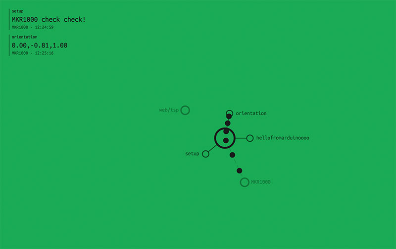

First the Arduino sends «MKR1000 Check Check» to the topic *setup*, then continuously sends the sensor-data in the form `x,y,z` to the topic `orientation`.  

Now let’s get back to cables …

### Controlling a box in cables via Arduino

Using our patch from before, which contains three ops (*Mqtt*, *MqttReceive* and *MqttSend*) we just have to modify the `Channel` input port of the *MqttReceive*-op to fit the channel we send the orientation values to (`/orientation`):

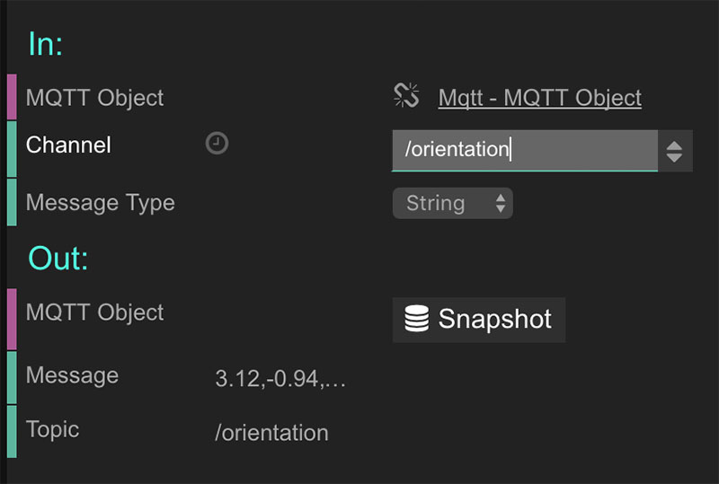

The *Message Type* can be left as *String*, because we send over the rotation data in a combined form as `x,y,z`. 

If the *Message*-port does not update as it should, try saving your patch and reload the browser.  

To make sense of the data we send over we have to take it apart, so that `x,y,z` can be used as three individual values `x`, `y` and `z`. For this we need to use the `SplitString`-op. Connect its input-port `Input Text` to the `Message`-output port of the `MqttReceive`-op.  

To make use of the data let’s create a cube which can rotate. Create a `MainLoop`-op (which is executed ~60 times per second and is needed as the starting point for every WebGL-patch in cables), a `Transform`-op (to do the rotation) and a `Cube`-op. 


You will now see a (boring) grey screen, this is because the cube is seen from the front and is very big, let’s correct this by selecting the `Transform`-op and changing the `Scale`-port to `0.5`.  

Now we see the cube (which looks like a rectangle, because we look at it from the front):


To make the cube rotate based on the data we receive from the Arduino all we need to do now is to connect the first three output ports of `SplitString` to the `rotX`, `rozY` and `rotZ`-ports of the `Transform`-op:  

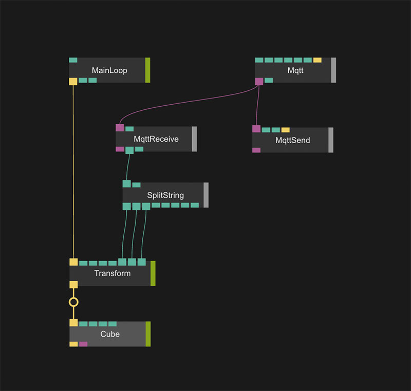

Now we should see the cube moving when we rotate the breadboard with the Arduino:

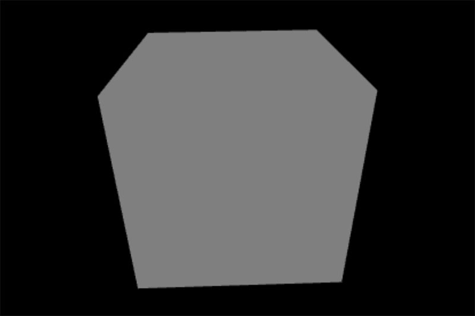.

The rotation is not right, yet, we have to switch the `rotX` and `rotY` connections:

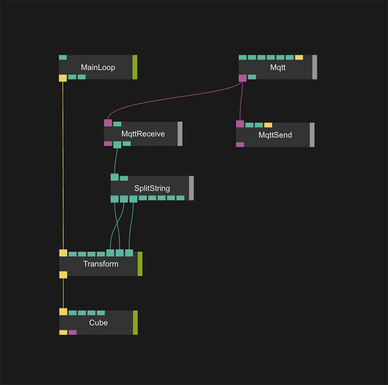


If this does not work for you, here are some things you should check:

- Is the Arduino sending data? Go to [shiftr.io](https://shiftr.io), click on your namespace and you should see if the Arduino sends data or not.
  - If it does not it is probably disconnected, try plugging it out and back in again.
  - Open the serial monitor and check if there are any connection errors
- if the Arduino is sending data but it is not coming in in cables try saving your patch and reloading the page or pressing the `Reconnect`-button in the `Mqtt`-op parameters.
- If the problem is on the Arduino side and it disconnects often, try changing the line `#define SEND_DELAY_MS (100)` – the milliseconds between each MQTT-send to a bigger value  – `#define SEND_DELAY_MS (300)`. 

## Arduino Code Explanations

So let’s talk a bit about the changes in our Arduino code after we combined the MQTT-example with the BNO055-example.

There are basically two important things:

We implemented a timer, so we only send out values every x milliseconds to not stress the MQTT-server too much.  

- `#define SEND_DELAY_MS (100)` – defines how often a MQTT-message should be sent
- `unsigned long lastMillis = 0;` – contains the milliseconds the last MQTT message was sent out

In the loop we use that value and compare it to the current time to decide wether or not it’s time to send out a message:  

```C
if(millis() - lastMillis > SEND_DELAY_MS) {
    lastMillis = millis();
```

The other important thing is *how* we send the data. We could send three individual values like that:

```C
client.publish("/orientation/x", event.orientation.x);
client.publish("/orientation/y", event.orientation.y);
client.publish("/orientation/z", event.orientation.z);
```

The only downside of this is that we would send three MQTT messages each time. If we wanted to send out sensor data each minute this would be the way to go. But as we want the cube to rotate smoothly we have to optimise it a bit to only send out one message instead. For this we combine the three values into one string `x,y,z`:  

```C
String orientationString = String("") +
          event.orientation.x + "," +
          event.orientation.y + "," +
          event.orientation.z
      ;
    
    // The channel this device sends to, the message
    client.publish("/orientation", orientationString);
```

Okay, that’s it for now, I hope you learned something and can start visualizing your Arduino sensor data in cables. In the following section we we build upon and add a LED ring which we can control from within cables.

## Controlling a NeoPixel LED ring with cables

### Testing the LED ring

As we did in earlier steps, let’s connect the LED ring and run a simple example to make sure everything is connected correctly.  

Connect the Adafruit Neopixel ring:

| Arduino MKR1000 | Adafruit Neopixel Ring |
| --------------- | ---------------------- |
| GND             | GND                    |
| VCC             | 5V DC Power            |
| Data Input      | 6                      |

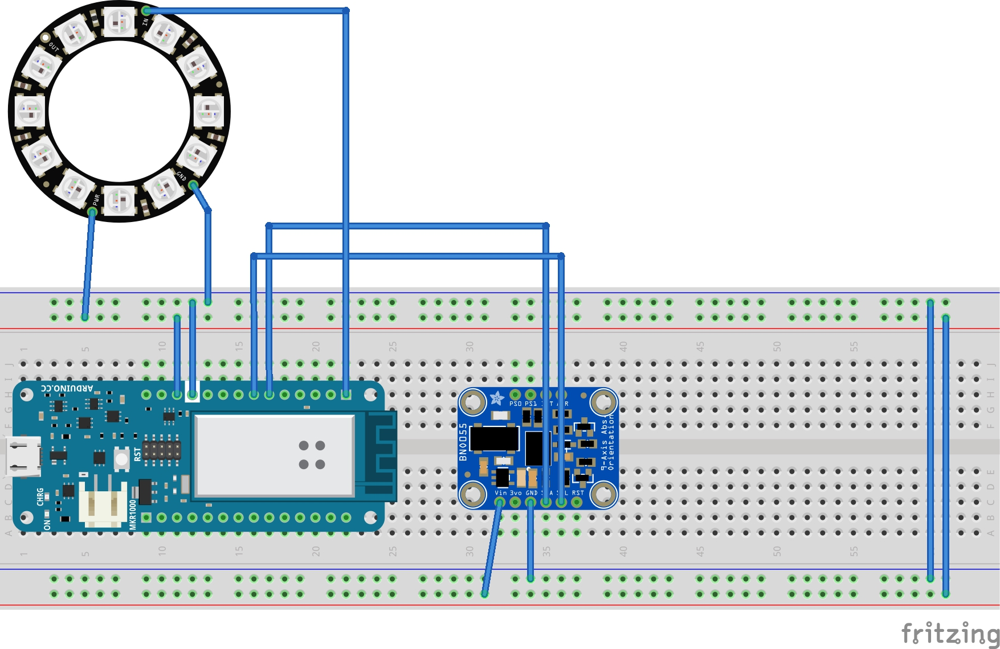


Now let’s run one of the NeoPixel examples to check if everything is working as it should. Open `Examples` —> `Adafruit Neopixel` —> `simple`.

Change the number of pixels in line 14:

```C
#define NUMPIXELS      16
```

needs to be:

```C
#define NUMPIXELS      12
```

Upload it and the LED ring should light up. Great! Now let’s integrate the code from the example into our main sketch. We just have to copy the needed parts to the right places – before `setup()` – inside `setup()` and inside `draw()`.

Now we have to make a few adjustments:    

Insert the following code somewhere before `setup()`:  

```C
// rgb color values
int r = 50;
int g = 50;
int b = 50;
```

We also change the code wich goes into `loop()` a bit, so that it uses these three variables to update the LEDs:  

```C
for(int i=0;i<NUMPIXELS;i++){
    pixels.setPixelColor(i, pixels.Color(r, g, b));
  }
  pixels.show(); // This sends the updated pixel color to the hardware.
```

Now we want to send data from cables to the Arduino with the color values in the form `r,g,b`, e.g. `255,0,0` (red). We already have a function called `messageReceived`, which will get called once data is send to the correct channel. We need to define that we want to get notified if there is something new send to the channel `/color`. If you copied the whole sketch from above, this should already be defined:  

```C
client.subscribe("/color");
```

Now we have to solve another problem – the incoming data is `r,g,b` – we need individual integer-values to send to the LED ring – for this a google search for `arduino split string` brings us to the following answer on Stack Overflow: [Arduino (C language) parsing string with delimiter)](http://stackoverflow.com/questions/11068450/arduino-c-language-parsing-string-with-delimiter-input-through-serial-interfa)

The first answer is exactly what we need. We just have to change our variable name from `myString` to `payload` – the variable used in the `messageReceived`-function.

Add the following code to the bottom of the `messageReceived`-function:  

``` C
int commaIndex = payload.indexOf(',');
//  Search for the next comma just after the first
int secondCommaIndex = payload.indexOf(',', commaIndex+1);
String firstValue = payload.substring(0, commaIndex);
String secondValue = payload.substring(commaIndex+1, secondCommaIndex);
String thirdValue = payload.substring(secondCommaIndex+1);
r = firstValue.toInt();
g = secondValue.toInt();
b = thirdValue.toInt();
```

Upload the code and then let’s get back to *cables* to send the color.

### Sending color values from cables

First, let’s add some color to our virtual cube – add the `BasicMaterial`-op in between the `Transform` and `Cube` ops.

Also add a `ColorValue`-op to store our color and connect the `outr`, `outb`

 and `outc` values to the `r`, `g` and `b` ports of the `BasicMaterial`-op. 

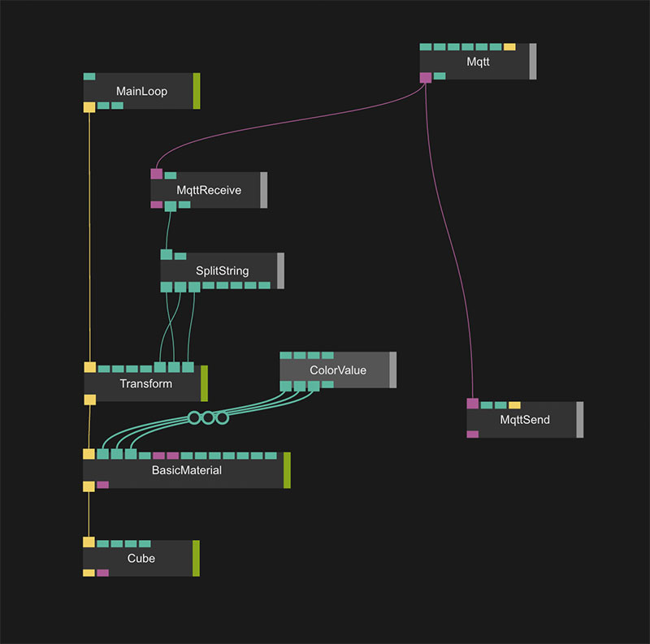

Now if you select the `ColorValue` of and turn the sliders the virtual cube should change its color.


The same value we now want to send to cables in the form `r,g,b`.  Before we send the values over to the Arduino we need to change it’s range, cables uses a color range `[0..1]` while the NeoPixel-library uses [0..255], we can easily convert our color range before we send it over by multiplying it with `255`.   

Connect one `Multiplier`-op each to the `outr`, `outg` and `outb`-port of the `ColorValue`-op and change their second port `Number2` to `255`. 

Before we can send it over we need to change one more thing – we need to combine the three values into one string `r,g,b` with the `Concat`-op, which joins two strings together. We will use it to combine `r` with `,` to return `r,`, then we do the same with `b`and the output we just generated to produce `r,g` and the same for `b`, so in the end we have `r,g,b`. Every time you want to append a comma, you need to set the `String2`-port of the `Concat`-op to `,`.  

Click on the last `Concat`-op and have a look at the `Result` output-port, if it looks something like this: `0.56,0.34…` it should be right.   

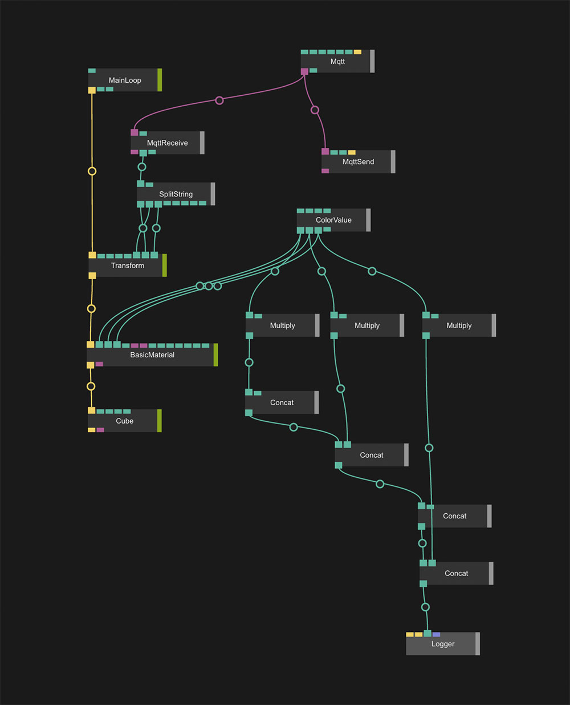

*Note: You can always see the results of an operation by connecting the `Log`-op to a port. Then you can see its value on the debug console – in Chrome you can open it using `CMD + ALT + j` , if everything is right putting a `Log`-op on the output of the last `Concat` will show something like this in the console: *  

```
["[Value] 65.28,1.134,0.3"]
```

The last part is interesting for us, looks like its in the form we need now – `r,g,b`. Let’s finally send the data out. Connect the output of the last `Concat`-op containing our `r,g,b`-string to the `Message`-port of the `MqttSend`-op. Let’s click on the `Send`-button of the `MqttSend`-op – if nothing happens check the debug console once again, by hitting `CMD + ALT + j`. If you see a `MQTTSend: Could not send message 65.28,1.134,0.3 to /test, maybe try to reconnect?!"]` – the connection timed out. In that case hit the `Reconnect`-button of the `Mqtt`-op and try again.  

Go to your namespace on [shiftr.io](https://shiftr.io) and check if the message is sent correctly to the server.

Nearly done. We now can change the color of the LED ring by changing the value if the `ColorValue`-op and pressing `Send` ond the `MqttSend`-op. To automate this we add the `Interval`-op which we connect to the `Send`-port of `MqttSend`. Set its `Interval`-port to something like `300` (milliseconds). If you set it too small you may be kicked from the server.

So here is the final code together with the layout in cables:


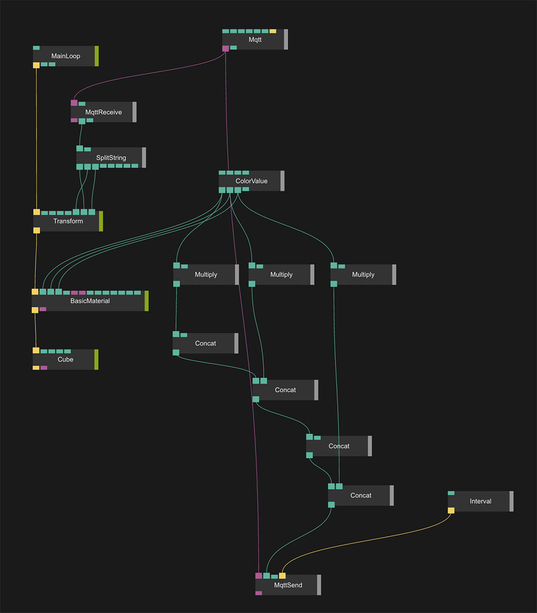

```C
/*
 * This example uses an Arduino / Genuino Zero together with
 * a WiFi101 Shield or a MKR1000 to connect to shiftr.io.
 * 
 * Libraries which need to be installed:
 *     - "WiFi101" (install via Arduino libraries manager)
 *     - "MQTT" (by Joel Gaehwiler, install via Arduino libraries manager)
 *     
 * By undev / cables.gl    
 * https://github.com/cables-gl/Workshop_Hyper_Island_2016
 *     
 * Based on example by Gilberto Conti
 * https://github.com/256dpi/arduino-mqtt       
 * 
 * You can check if your device successfully sends messages here:
 * https://shiftr.io/try
 * Also open the serial monitor in Arduino to check for errors
 * 
 * Connections: 
 * - BNO055: Arduino MKR1000
 *   - GND: GND
 *   - VIN: VCC
 *   - SDA: SDA
 *   - SCL: SCL
 *  - Adafruit NeoPixel Ring 12: Arduino MKR1000
 *    - GND: GND
 *    - 5V Power: VCC
 *    - Data Input: 6
  */
  
  /* Board layout:
         +----------+
         |         *| RST   PITCH  ROLL  HEADING
     ADR |*        *| SCL
     INT |*        *| SDA     ^            /->
     PS1 |*        *| GND     |            |
     PS0 |*        *| 3VO     Y    Z-->    \-X
         |         *| VIN
         +----------+
  */
 

#include <SPI.h>
#include <WiFi101.h>
#include <Wire.h>
#include <MQTTClient.h>
#include <Adafruit_Sensor.h>
#include <Adafruit_BNO055.h>
#include <utility/imumaths.h>

#include <Adafruit_NeoPixel.h>
#ifdef __AVR__
  #include <avr/power.h>
#endif

#include "config.h" // WLAN / MQTT user credentials

// how often messages are send (in milliseconds)
#define SEND_DELAY_MS (100)

Adafruit_BNO055 bno = Adafruit_BNO055(55);

int status = WL_IDLE_STATUS;     // the Wifi radio's status
unsigned long lastMillis = 0;

#define NEOPIXEL_PIN 6
#define NUMPIXELS 12

WiFiClient net;
MQTTClient client;

// rgb color values
int r = 50;
int g = 50;
int b = 50;

Adafruit_NeoPixel pixels = Adafruit_NeoPixel(NUMPIXELS, NEOPIXEL_PIN, NEO_GRB + NEO_KHZ800);

void setup() {
  Serial.begin(115200);
  while (!Serial) {
    ; // wait for serial port to connect. Needed for native USB port only
  }

  pixels.begin(); // This initializes the NeoPixel library.

  // check for the presence of the shield:
  if (WiFi.status() == WL_NO_SHIELD) {
    Serial.println("WiFi shield not present");
    // don't continue:
    while (true);
  }

  // attempt to connect to Wifi network:
  while ( status != WL_CONNECTED) {
    Serial.print("Attempting to connect to WPA SSID: ");
    Serial.println(ssid);
    // Connect to WPA/WPA2 network:
    status = WiFi.begin(ssid, pass);

    // wait 10 seconds for connection:
    delay(2000);
  }

  // you're connected now, so print out the data:
  Serial.print("You're connected to the network");
  printCurrentNet();
  printWifiData();

  // setup MQTT
  Serial.print("Connecting to MQTT-server "); Serial.println(mqtt_server);
  client.begin(mqtt_server, net);
  while (!client.connect(device_name, mqtt_username, mqtt_password)) {
    Serial.print(".");
    delay(1000);
  }
  client.subscribe("/color");
  Serial.println("");
  client.publish("/setup", "MKR1000 check check!");

  Serial.println("Orientation Sensor Test"); Serial.println("");

  /* Initialise the sensor */
  if(!bno.begin()) {
    /* There was a problem detecting the BNO055 ... check your connections */
    Serial.print("Ooops, no BNO055 detected ... Check your wiring or I2C ADDR!");
    while(1);
  }

  /* Display some basic information on this sensor */
  displaySensorDetails();
}

void loop() {
  client.loop();

  for(int i=0;i<NUMPIXELS;i++){
    pixels.setPixelColor(i, pixels.Color(r, g, b));
  }
  pixels.show(); // This sends the updated pixel color to the hardware.

  /* Get a new sensor event */
  sensors_event_t event;
  bno.getEvent(&event);

  // publish a message when it's time
  if(millis() - lastMillis > SEND_DELAY_MS) {
    lastMillis = millis();
    
    
      String orientationString = String("") +
          event.orientation.x + "," +
          event.orientation.y + "," +
          event.orientation.z
      ;
    
    // The channel this device sends to, the message
    client.publish("/orientation", orientationString);

    /* roll, pitch, heading, see diagram on top */
    /*
    Serial.print(F("Orientation: "));
    Serial.print((float)event.orientation.x);
    Serial.print(F(" "));
    Serial.print((float)event.orientation.y);
    Serial.print(F(" "));
    Serial.print((float)event.orientation.z);
    Serial.println(F(""));
    */
  }
}

void printWifiData() {
  // print your WiFi shield's IP address:
  IPAddress ip = WiFi.localIP();
  Serial.print("IP Address: ");
  Serial.println(ip);
  Serial.println(ip);

  // print your MAC address:
  byte mac[6];
  WiFi.macAddress(mac);
  Serial.print("MAC address: ");
  Serial.print(mac[5], HEX);
  Serial.print(":");
  Serial.print(mac[4], HEX);
  Serial.print(":");
  Serial.print(mac[3], HEX);
  Serial.print(":");
  Serial.print(mac[2], HEX);
  Serial.print(":");
  Serial.print(mac[1], HEX);
  Serial.print(":");
  Serial.println(mac[0], HEX);

}

void printCurrentNet() {
  // print the SSID of the network you're attached to:
  Serial.print("SSID: ");
  Serial.println(WiFi.SSID());

  // print the MAC address of the router you're attached to:
  byte bssid[6];
  WiFi.BSSID(bssid);
  Serial.print("BSSID: ");
  Serial.print(bssid[5], HEX);
  Serial.print(":");
  Serial.print(bssid[4], HEX);
  Serial.print(":");
  Serial.print(bssid[3], HEX);
  Serial.print(":");
  Serial.print(bssid[2], HEX);
  Serial.print(":");
  Serial.print(bssid[1], HEX);
  Serial.print(":");
  Serial.println(bssid[0], HEX);

  // print the received signal strength:
  long rssi = WiFi.RSSI();
  Serial.print("signal strength (RSSI):");
  Serial.println(rssi);

  // print the encryption type:
  byte encryption = WiFi.encryptionType();
  Serial.print("Encryption Type:");
  Serial.println(encryption, HEX);
  Serial.println();
}


void messageReceived(String topic, String payload, char * bytes, unsigned int length) {
  Serial.print("incoming: ");
  Serial.print(topic);
  Serial.print(" - ");
  Serial.print(payload);
  Serial.println();
  int commaIndex = payload.indexOf(',');
  //  Search for the next comma just after the first
  int secondCommaIndex = payload.indexOf(',', commaIndex+1);
  String firstValue = payload.substring(0, commaIndex);
  String secondValue = payload.substring(commaIndex+1, secondCommaIndex);
  String thirdValue = payload.substring(secondCommaIndex+1); // To the end of the string
  r = firstValue.toInt();
  g = secondValue.toInt();
  b = thirdValue.toInt();
  Serial.print("New color: "); Serial.print(r); Serial.print(", "); Serial.print(g); Serial.print(", "); Serial.println(b);
}

/**************************************************************************/
/*
    Displays some basic information on this sensor from the unified
    sensor API sensor_t type (see Adafruit_Sensor for more information)
*/
/**************************************************************************/
void displaySensorDetails(void) {
  sensor_t sensor;
  bno.getSensor(&sensor);
  Serial.println("------------------------------------");
  Serial.print  ("Sensor:       "); Serial.println(sensor.name);
  Serial.print  ("Driver Ver:   "); Serial.println(sensor.version);
  Serial.print  ("Unique ID:    "); Serial.println(sensor.sensor_id);
  Serial.print  ("Max Value:    "); Serial.print(sensor.max_value); Serial.println(" xxx");
  Serial.print  ("Min Value:    "); Serial.print(sensor.min_value); Serial.println(" xxx");
  Serial.print  ("Resolution:   "); Serial.print(sensor.resolution); Serial.println(" xxx");
  Serial.println("------------------------------------");
  Serial.println("");
  delay(500);
}


```


Okay, hope you had fun, the final *cables*-patch will be published soon as well…


