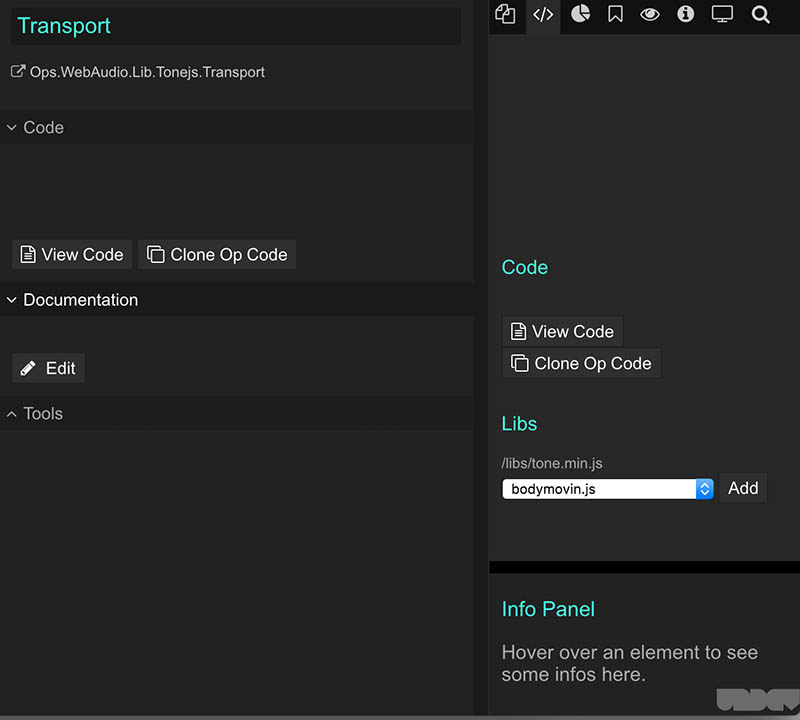

# Web Audio Op Development

The Web Audio ops available in cables closely wrap the audio nodes of the [Web Audio API](https://developer.mozilla.org/de/docs/Web/API/Web_Audio_API).

For convenience you can also access [tone.js](https://tonejs.github.io/), a powerful Web Audio library, which makes certain things like timing easier.

## Building Web Audio ops

Create a new op and make sure to include the following line at the top of your patch, just below your op-name definition:

```javascript
op.name = "MyNewWebAudioOp";
CABLES.WEBAUDIO.createAudioContext();
// now window.audioContext is set and you can use all of the Web Audio nodes
```


## Building tone.js-compatible ops 

Building tone.js-compatible ops / wrapper is as straightforward as creating normal Web Audio ops. There are a few things you need to take care of:


Create a new empty op, give it a name, save the op and patch, refresh the browser (*yes, this needs to be fixed*), press ESC to add your newly created op to the patch, then select the op and code-tab on the right of the window. If you don’t see it you need to resize the panes accordingly.



Now select `tone.js`, click `Add`, save your patch and reload the page.

In order to use tone.js there is one thing left to do: In your op-code add the following line below your op-name definition, it should look like this:

```javascript

CABLES.WEBAUDIO.createAudioContext();
Tone.setContext(window.audioContext);
// now you can use all Web Audio nodes / tone.js functions
```

