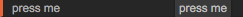
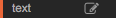

# Ports (for Developers)

This documentation is intended for developers, if you just want to use the existing ops and learn about ports, check out the [doc: Ports](#) documentation.  

## Port Types

There are different types of ports your op can use:  

- `OP_PORT_TYPE_FUNCTION` – (blue) function port
- `OP_PORT_TYPE_VALUE` – (orange) value port
- `OP_PORT_TYPE_ARRAY` – (purple) array port
- `OP_PORT_TYPE_OBJECT` – (green) object port

### Function Ports

```
OP_PORT_TYPE_FUNCTION
```

Function ports are being used to trigger another op. If you do a visual-patch the first op you need to add is the [op: Renderer](#)-op, which has a `trigger`-port – a function port which updates all connected ports 60 times a second.
Function ports can also be used to trigger under certain conditions – the [Op: Mouse](#)-op e.g. triggers on the `click`-port once a user clicked in the preview pane.

```
var exec = this.addInPort( new Port( this, "exec", OP_PORT_TYPE_FUNCTION ));
var next = this.addOutPort( new Port( this, "next", OP_PORT_TYPE_FUNCTION ));

exec.onTrigger( function(){
	// ...
	next.trigger(); // trigger connected ops
});
```

### Value Ports

```
OP_PORT_TYPE_VALUE
```

Value ports can hold a single value, a number (e.g. -1, 2.45), a bool (true, false), a string ("foo bar"), a string with multiple lines or a certain value from a dropdown-input. 

```
var inPort = this.addInPort( new Port( this, "in port", OP_PORT_TYPE_VALUE ) );
var outPort = this.addOutPort( new Port( this, "out port", OP_PORT_TYPE_VALUE ) );
```

- Use `outPort.set(x);` / `inPort.set(x);` to change the value of a port
- Use `inPort.get();` to get the current value of a port

**TODO: Implement onTrigger Callback**

#### Parameters

##### Display: Value (Default)

**TODO: Implement default, right now, just remove display if you want the default UI-element `**  

```
var inPort = this.addInPort( new Port( this, "in port", OP_PORT_TYPE_VALUE ) );

inPort.onValueChange( function() {
    this.log('in port changed to:' + inPort.get());
});
```

Text-input-field which can be used to enter numbers, booleans and strings.

##### Display: Range

##### Display: Bool

##### Display: Button

  

```
var tap = this.addInPort( new Port( this, "tap", OP_PORT_TYPE_FUNCTION, {"display": "button"} ) );

tap.onTriggered(function(){
	this.log( "tab pressed" );
});
```

##### Display: Editor




```
var text = this.addInPort( new Port( this, "text", OP_PORT_TYPE_VALUE, { display: 'editor' } ) );

text.onValueChange( function() {
    this.log('text changed to:' + text.get());
});
```

If you click the edit button, text can be edited in the editor. Used for all kinds of multiline-input.

##### Display: Dropdown

For a fixed amount of values to choose from.

```
var align = this.addInPort( new Port( this, "align", OP_PORT_TYPE_VALUE, { display: 'dropdown', values: ['left', 'center', 'right'] } ) );
```

### Array Ports

```
OP_PORT_TYPE_ARRAY
```

A Javascript array, which can either contain simple values, arrays or objects.

E.g. `[1, 2, 3]`, `[[1, 2], [3, 4]]`, `[{"one": 2}, {"three": 4}]`

### Object Ports

```
OP_PORT_TYPE_OBJECT
```
An object can contain basically anything, e.g.:

```
{
  "a": 123,
  "b": "foo",
  "c": true,
  "d": {
    "e": [1, 2, 3, 4]
  }
}
```
