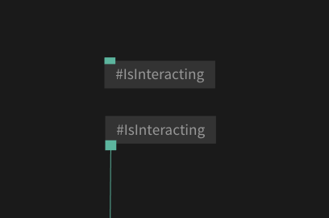

# Embedding Patches

## Variables

To work with variables in cables you can use the ops "SetVariable" and "Variable".
Variables are handy if you need the same values in many locations in your patch.



- "SetVariable" - Set the value of the variable
- "Variable" - Read variable value

In a typical Situations you have one SetVariable op and multiple Variable ops.

## Settings variables programmatically

when embedded into a website you can programmatically change the values of variables:

```javascript
var v=CABLES.patch.getVar("IsInteracting");

if(v)
{
    // get the current value
    v.getValue(); 

    // change value
    v.setValue(true);    
}
```

### listening to variable change

you can add a listener to a variable to have a callback called every time a variable value was changed

```javascript
var v=CABLES.patch.getVar("IsInteracting");

if(v)
{
    // get the current value
    v.addListener(function(val)
    {
        // will be called every time value changes
        console.log(val);
    });
}
```