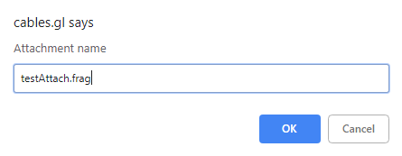
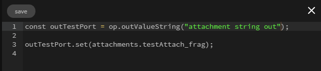

# Creating Attachments

Attachments are files that can be created and read as a string in the op they are attached to.  

An attachment file can be created by clicking on an op and then clicking the create button

 

 

Fill in the name of your attachment file

 

You can edit the attachment file by clicking on the edit button

This will open the editor allowing you to add your own script

The attachment can now be accessed inside of your op, select the op and press 'e' to enter edit mode.

 

 

