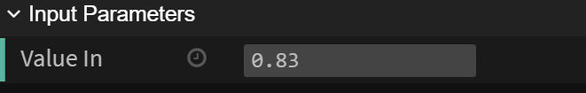
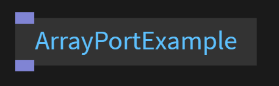
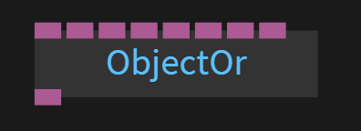
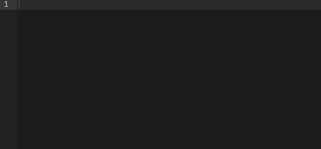

# Ports

## Port Types

These are the different types of ports your op can use:  

### Trigger Ports - Yellow

 <br>

Trigger ports are  used to trigger another op. 
Trigger ops can also have a button in the op pane which can be clicked<br>


Click this [link](dev_ports_trigger/dev_ports_trigger.md) for an example 


### Value Ports - Green

 

Value ports can hold a single value, a number (e.g. -1, 2.45), a bool (true, false), a string ("foo bar"), a string with multiple lines or a certain value from a dropdown-input.
Creating a value port also creates a slider in the ui pane which can be used<br>


Click this [link](dev_ports_value/dev_ports_value.md) for an example 


### String Ports - Green

 

JavaScript strings are used for storing and manipulating text
A string is zero or more characters written inside quotes

Eg. `"This is a string" "this as well 123456789"`

Click this [link](dev_ports_string/dev_ports_string.md) for an example 


### Boolean Ports - Green

 

Boolean ports can hold one of two values : true or false

Click this [link](dev_ports_boolean/dev_ports_boolean.md) for an example 


### Array Ports - Light purple

 

A Javascript array can contain either simple values, arrays or objects<br>
Arrays are used to store multiple values in a single variable.

E.g. `[1, 2, 3]`, `[[1, 2], [3, 4]]`, `[{"one": 2}, {"three": 4}]`

Click this [link](dev_ports_array/dev_ports_array.md) for an example 


### Object Ports - Dark purple

 

Click this [link](dev_ports_object/dev_ports_object.md) for an example 


##### Display: String

```javascript
var inPort = op.addInPort("inPort");

inPort.onChange=function() {
	op.log( "Port changed to: " + inPort.get() === "foo bar" );
};
```

##### Display: Editor




```javascript
var text = op.addInPort( new Port("text");

text.onChange=function() {
    op.log('text changed to:' + text.get());
};
```

If you click the edit button, text can be edited in the editor. Used for all kinds of multiline-input.

It is also possible to define the syntax highlighting for the editor-tab:

```javascript
var styleSheetPort = op.addInPort(
    new CABLES.Port(op, "Stylesheet",CABLES.OP_PORT_TYPE_VALUE, {
        display: 'editor',
        editorSyntax: 'css'
    })
);
```

##### Display: Dropdown

For a fixed amount of values to choose from.

```javascript
var align = op.addInPort( new Port( op, "align",CABLES.OP_PORT_TYPE_VALUE, { display: 'dropdown', values: ['left', 'center', 'right'] } ) );
```

### Array Ports

```
OP_PORT_TYPE_ARRAY
```

A Javascript array, which can either contain simple values, arrays or objects.

E.g. `[1, 2, 3]`, `[[1, 2], [3, 4]]`, `[{"one": 2}, {"three": 4}]`

### Object Ports

```
OP_PORT_TYPE_OBJECT
```

An object can contain basically anything, e.g.:

```javascript
{
  "a": 123,
  "b": "foo",
  "c": true,
  "d": {
    "e": [1, 2, 3, 4]
  }
}
```


## Port linking

Once a port is linked with another port `myPort.onLinkChanged` is executed. When it is executed the port may not have a value yet, it just sais: «There is a new connection». Later on `myPort.onLinkChanged` is called and you can get the new value with `myPort.get()`.

```javascript
var myPort = op.inFloat("My Port");

myPort.onLinkChanged = function() {
	op.log("A link to myPort has been added or removed");
	if(myPort.isLinked()) {
		op.log("myPort has been linked");
	} else {
		op.log("myPort has been unlinked ");
	}
};

myPort.onLinkChanged = function() {
	op.log("The value on myPort changed to: ", myPort.get());
}
```

If you need to access to other (linked) port you can also do so:

```javascript
myPort.onLinkChanged = function() {
	op.log("A link to myPort has been added or removed");
	if(myPort.isLinked()) {
		op.log("myPort has been linked");
		// get the other port, as there can be multiple connections, get the last added one
		var otherPort = myPort.links[links.length-1].getOtherPort(myPort);
		op.log("Port is linked to: ", otherPort.name);
	} else {
		op.log("myPort has been unlinked ");
	}
};
```
