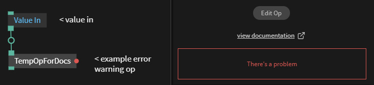

# GUI/UI attributes

## Group Ports

to bundle ports into groups and set a visual divider between them:

```
op.setPortGroup('Display',[portScale,portFont]);
op.setPortGroup('Alignment',[portAlign,portVAlign]);
op.setPortGroup('Color',[r,g,b,a]);
```

## Hide port
To hide a port on a op but still have a UI element use the following code

```javascript
portName.hidePort();
```

## Warnings and Errors

Ui attributes of an op can be set to give the user warnings and give visual feedback about things that may require their attention.
<br>
The following example will give an error in the OP UI and show a red circle if the value coming in is above 1.0
<br>

<br>

If the value is lower than 0 then the UI will show this message

<br>

```javascript
//create a port for value input
const inVal  = op.inValueFloat ("Value in");
//create a port for value output
const outVal = op.outValue("value out");

//when inVal changes run this function
inVal.onChange = function()
{
	
    if(inVal.get() > 1.0)
    {
    	//this causes the op to show a red circle
    	//and show "There's an error" in the op UI
        op.uiAttr({ error :"There's an error"});
    }
    else
    {
    	//clear the UI 
        op.uiAttr({ error : null });
    }
    if(inVal.get() < 0.0)
    {
    	//if value in is below 0.0 the following message is displayed 
    	//in the UI
        op.uiAttr({ warning :"There's a problem, value is below 0.0"});
    }
    else
    {
    	//clear the UI 
        op.uiAttr({ warning : null });
    }
};
```
