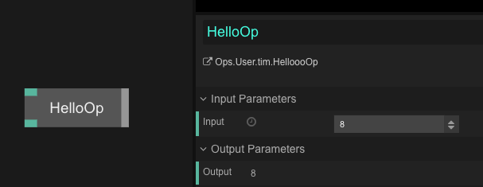
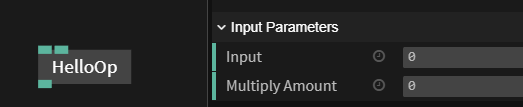

# Hello Op - Part 1

Let’s write our first op, which has a value input and output.

Create a new op by clicking `Op` -> `Create` (in the navigation bar at the top left part of the screen).
Or you can press escape to browse to the ops menu then enter your own unique op name in the search bar, then click the button with `Create Ops.User.YourUserName.YourOpsName` to create your own op.  

A naming example below:
```javascript
`HelloOp` is the short-name of your op and `Ops.user.yourname.HelloOp` the unique name. 
```
Now add the following code:    

```javascript
const myInPort = op.inFloat("Input");
```
We have now created a new variable of the type value. Lets break this line of code down:
- **var** creates a new variable
- **myInPort** is the name of the variable, you could write anything here
- **op** references to the operator itself **.inFloat("Input")** creates an input port of the type value

Don't worry if your not following this all right now, it will all make much more sense later on :)

We have now defined a new port called `myInPort` with the visible text label `My In Port`, which can be used to enter a value in op-settings or act as input from another op. 
In this example we will just forward the input value to an out-port. So let’s define it below:

```javascript
var myOutPort = op.outNumber("Output");
```

In the top of the editor window click on `Save` and afterwards `Execute`, now reload the patch (the browser window) by pressing `cmd + r`. Now click on `Op` —> `Add` on the very top of the window, enter the name of the op you just created – `HelloOp` and press Enter.

You now see your newly created op with one input- and one output-port:


Let’s add some logic to the op – whenever the input-port `myInPort` changes (has a new value) we want to  set the output port `myOutPort` accordingly. For now we just pass the input value through to the output port.

To get notified when the input-port has a new value we need the function `onChange` which gets called every time there is a new value on the `myInPort` port. 
Add the following lines below:

```javascript
myInPort.onChange = function() 
{
  	var inputValue = myInPort.get(); // get the new value from the input port
    myOutPort.set(inputValue); // set the output value
};
```

`Save` / `Execute` the editor and try it out: Select your op and enter another input value – you will see that the output value will also update. Nice!



Your op-code should look like this now:  

```javascript
const myInPort = op.inFloat("Input");
const myOutPort = op.outNumber("Output");

myInPort.onChange = function() 
{
  	var inputValue = myInPort.get(); 
    myOutPort.set(inputValue);
};
```

Now let’s add some logic, every time the input value changes we want the output value to be multiplied by two, all we have to do is to add a `2*`.

Change this:  

```javascript
myOutPort.set(inputValue);
```

to:  

```javascript
myOutPort.set(2 * inputValue);
```


That’s it for now – you created your first op which multiplies values by two!

For other port-types check out [Ports Documentation](../dev_creating_ports/dev_creating_ports.md).

# Hello Op - Part 2

It's time to make our patch a little bit more advanced. 
To change the multiplication amount we have to go into the code editor which is a slow way to work.
We'll create a second input port and use this to define the multiplication amount.
Add the following line of code below the first **myInputPort**
```javascript
const multiplyValueIn = op.inFloat("Multiply amount");
```

This creates a second port and a new part on the object pane which allows us to set the multiplication amount.
Your op should now look like this




Your code should look like this
```javascript
const myInPort = op.inFloat("Input");
const multiplyValueIn = op.inFloat("Multiply amount");
const myOutPort = op.outNumber("Output");
```


We learnt that we can call a function when a input port detects a change. This is a great way to make something happen with small simple ops, with larger more complicated ops this method can become hard to keep track of.
If we'd follow this way of doing things we'd have to make two functions for each input port like this. 

```javascript
myInPort.onChange = function()
{
    const inputValue = myInPort.get() * multiplyValueIn.get() ;
    myOutPort.set(inputValue);
}

multiplyValueIn.onChange = function()
{
    const inputValue = myInPort.get() * multiplyValueIn.get();
    myOutPort.set(inputValue);
}

```

We are basically duplicating the code which is something we generally want to try and avoid. 
There's a great way to get around this by making our own custom function.
We will call this code **update**, the normal syntax for making your own function is this

```javascript
function myFunctionName()
{
  //code gos here
}
```
Replace the previous code with this:
```javascript
//calls the update function on a change
myInPort.onChange = update;

//calls the update function on a change
multiplyValueIn.onChange = update;

//the function update is called whenever a port changes
function update ()
{
    var result = myInPort.get() * multiplyValueIn.get() ;
    myOutPort.set(result);
}
```
We now have one function that is called whenever one of our input ports detects a change. This makes it far easier to keep track of what our code is doing.


