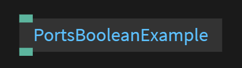

# Boolean ports

This page will explain how to create an input and output port of the type 'Boolean'<br>
 <br>
Click this [link](https://cables.gl/ui/#/project/5b9f692e671e52e512ab3af3) to see an example of all port types and code examples

A JavaScript Boolean represents one of two values: true or false

The following code snippet will create one input and output port of the type `Boolean`<br>
The input  will be passed out of the output port
This will also create a checkbox which can be clicked<br>


```javascript
//strict mode allows us to write cleaner code
"use strict";

//Create a input port of the type Boolean
const inBoolean = op.inBool("Boolean in");

//Create a output port of the type value
const outBoolean = op.outBool("Boolean out");

//when input port changes call the function 'update'
inBoolean.onChange = update;

//this function runs every time the input port changes
function update()
{
    //set the ouput port to the value of the input port
    outBoolean.set(inBoolean.get());
}
```

Follow this [link](../../dev_callbacks/dev_callbacks.md) for more information on Callbacks


