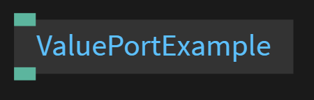

# Floating Point Number Ports

This page will explain how to create an input and ouput port of the type `Number`<br>
<br> 
Click this [link](https://cables.gl/ui/#/project/5b9f692e671e52e512ab3af3) to see an example of all port types and code examples

JavaScript does not define different types of numbers, like integers, short, long, floating-point etc <br>
JavaScript numbers are always stored as double precision floating point numbers

Value ports can hold a single float like -1 or 2.45

```javascript
//strict mode allows us to write cleaner code
"use strict";

//Create a input port of the type value
const inVal   = op.inFloat("Value in");
//Create a output port of the type value
const outResult  = op.outNumber("Value out");

//when input port changes call the function 'update'
inVal.onChange = update;

//this function runs every time the input port changes
function update()
{
    outResult.set(inVal.get());
}
```

Follow this [link](../../dev_callbacks/dev_callbacks.md) for more information on Callbacks
