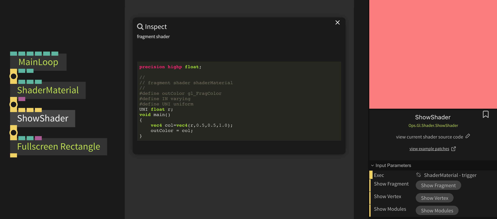

# Writing Shaders

### Parameter Qualifiers

for better compatibility between webgl 1.x and 2.x, or GLSL v1 and v3 we use predefined qualifiers.

In GLSL >=3.0 you do not use qualifiers like `attribute` or `varying`, but `in` and `out`.

In cables we use `IN`, `OUT` and `UNI`, then your shader can be compiled for both GLSL versions used in webgl.


#### Vertex Shader Qualifiers

| GLSL 1.0    | GLSL 3.0  | cables |
| ----------- | --------- | ------ |
| `varying`   | `out`     | `OUT`  |
| `attribute` | `in`      | `IN`   |
| `uniform`   | `uniform` | `UNI`  |

#### Fragment Shader Qualifiers

| GLSL 1.0  | GLSL 3.0  | cables |
| --------- | --------- | ------ |
| `varying` | `in`      | `IN`   |
| `uniform` | `uniform` | `UNI`  |

------


### default cables inputs

#### vertex shader

```
vec3 vPosition;  	   - vertex position in object space
vec2 attrTexCoord; 	   - vertex texture coordinates
vec3 attrVertNormal;   - vertex normal

mat4 projMatrix;       - projection matrix
mat4 mvMatrix;         - modelview matrix
mat4 modelMatrix;      - model matrix
mat4 viewMatrix        - view matrix
mat4 inverseViewMatrix - inverted view matrix
```

#### fragment shader

```
IN vec2 texCoord;      - texture coordinate
IN vec3 norm;          - normal
```

------

### Ops.Gl.Shader.ShaderMaterial

`Ops.Gl.Shader.ShaderMaterial` can be used to live-edit shaders and see the results immediately. 
You can use shaderMaterial with any kind of mesh and the mesh will be drawn using your custom shader.


You can edit Fragment and Vertex Shader Code.

Uniforms are automatically added as Ports of the ShaderMaterial Op. (Currently `float` and `sampler2D`)

------


### Ops.Gl.Shader.ShowShader



You can always use `Ops.Gl.Shader.ShowShader` to view the source code of the current shader.