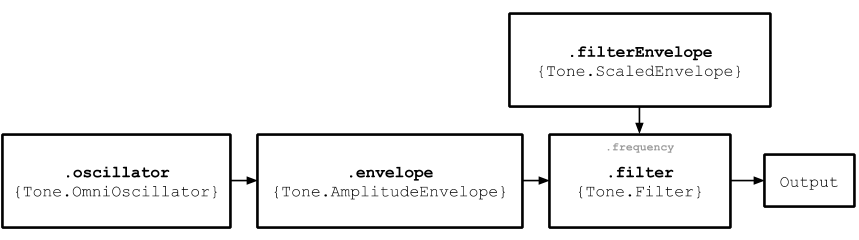

# MonoSynth

*Ops.WebAudio.Lib.Tonejs.Instrument.MonoSynth*     

MonoSynth is composed of one oscillator, one filter, and two envelopes. The amplitude of the Oscillator and the cutoff frequency of the Filter are controlled by Envelopes.

## Input

### Detune [Number]

The detune amount in cents – `100` = one semitone up

### Portamento [String]

The glide time between notes.

### Volume [String]

The volume of the output in decibels.

## Output

### Audio Out [Audio]

The audio signal