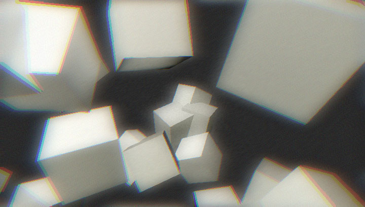
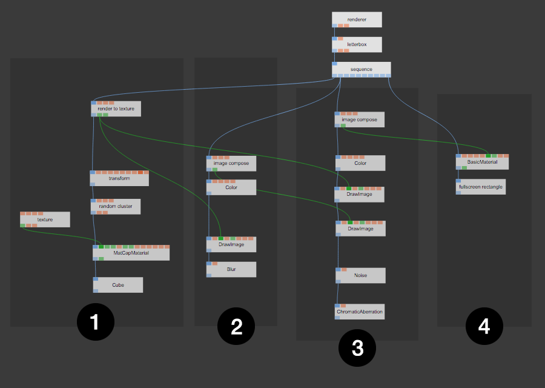
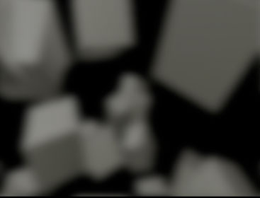

# Post-Processing 3D Scenes

You can find the finished patch here: [postprocessing](https://cables.gl/p/5645f59a9a013fa25927562a).

## Step 1

- Render a scene to a texture

Resulting texture: (grey lines are transparent)

## Step 2

- Blur the resulting texture using `image compose` into a new one

Resulting texture:  

## Step 3

- Compose a new image:
  - Set a background color
  - Draw the image from step 1
  - Draw the blurred image from step 2 using `blendmode`: `add`
  - Apply effects like `Noise` and `ChromaticAberration`

Resulting texture:  

## Step 4

- Draw the compose image to the screen

