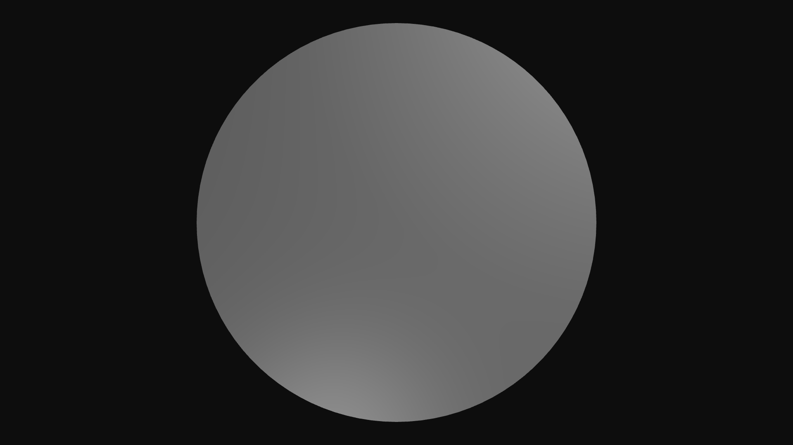

# Circle

*Ops.Gl.Meshes.Circle*  

Draws a circle to the canvas.

## Input

### Render

*Type: Function*  
Executes the op, renders a circle to the canvas.

### Segments

*Type: Value*  
The number of segments, when small (e.g. `3`) it will turn into a triangle / polygon.

### Radius

*Type: Value*  
Radius of the circle

### Inner Radius

*Type: Value*  
The inner radius defines the radius of cut-out of the original circle.

### Percent

*Type: Value*  
Defines how many segments of the circle are drawn, `0` = none, `1` = all.

### Steps

*Type: Value*  
Think of a lifebelt, some segments are skipped. `0` = all segments are drawn, `2` = every second, `3` = every third, …

## Output

### Trigger

*Type: Function*  
Every time `Circle` is triggered, it will also trigger all connected ops.

## Examples

- [Circle Example](https://cables.gl/ui/#/project/570287b85cac100233a4f85f)
- [Circle Example 2](https://cables.gl/ui/#/project/56f2ae421c53758d5cf03cf7)
- [Circle with Mouse Interaction](https://cables.gl/ui/#/project/57038bd4caa091505d4d6d8f)
