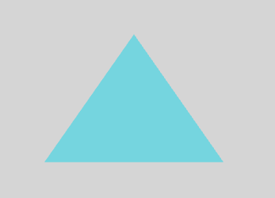

# Triangle

*Ops.Gl.Meshes.Triangle*  

Draws a triangle to the canvas.

## Input

### Render [Function]

Renders a circle to the canvas.

### Width [Value]

Width of the triangle

### Height [Value]

Width of the triangle

## Output

### Trigger [Function]

Every time `Circle` is triggered, it will also trigger all connected ops.

### Geometry [Texture]

**TODO**

## Example

- [Simple Triangle Example](https://cables.gl/ui/#/project/57038db0caa091505d4d6d92)