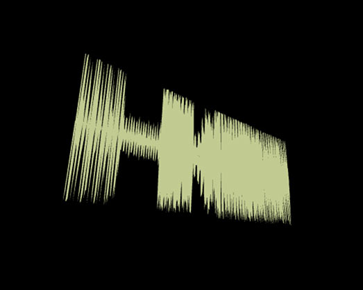

# Waveform

Outputs the waveform of an audio file. 

## Inputs

## Render [Function]

Renders the waveform and triggers `Next` when done

### Audio Buffer [Object]

Connect this to an `AudioBuffer` -op, which loads and holds an audio sample

## Width [Number]

The width of the waveform

### Samples Per Pixel [Number]

Controls how detailled the waveform is, the smaller the value the more detail and the wider the output. 

## Show Bottom Half [Bool]

When enabled the top half of the waveform will be mirrored, when disabled only the upper half is drawn

## Center Origin [Bool]

When enabled the waveform will be centered around the origin, e.g. useful when using `OrbitControls` and rotating around the origin. When disabled the waveform will start at the origin.

## Render Active [Bool]

If you only need the `Spline Points` or `Geometry` (not render it in the op), you can disable this to save resources.

## Output

### Next [Function]

Called after `Render` was called, triggers the next op

### Spline Points [Array]

The single points of the Waveform, can be connected e.g. to a `SimpleSpline`-op.

## Geometry [Object]

The geometry of the waveform, can be drawn e.g. with `RenderGeometry`